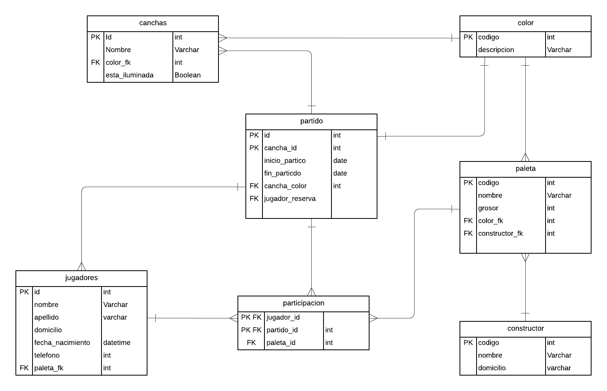
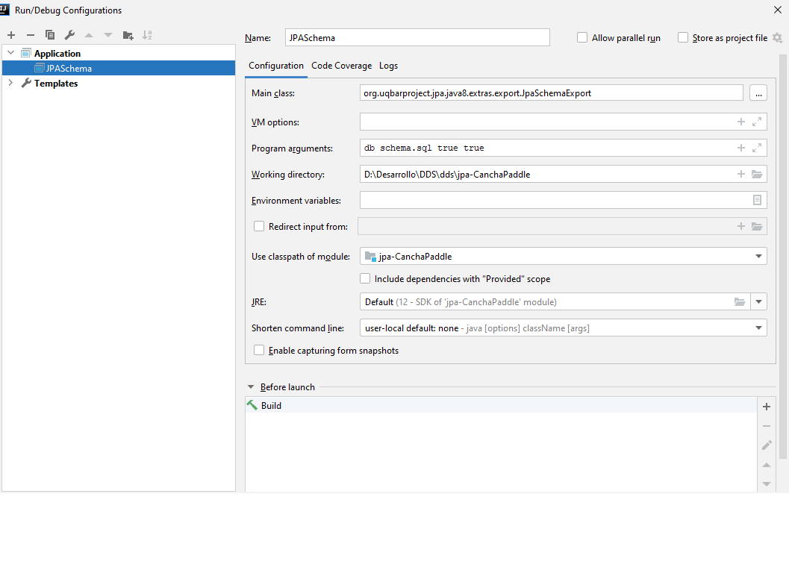

#JPA - Mapeo Canchas de Paddle

###Diagrama de entidad relación

### Dependencias
	
    <dependency>
   		 <groupId>org.uqbar-project</groupId>
   		 <artifactId>jpa-java8-extras</artifactId>
   		 <version>1.0-alpha-1</version>
   	 </dependency>

   	 <dependency>
   		 <groupId>org.hsqldb</groupId>
   		 <artifactId>hsqldb</artifactId>
   		 <version>2.4.0</version>
   	 </dependency>

###  Configurar JPASchemaExport
Main Class debe ser:  “org.uqbarproject.jpa.java8.extras.export.JpaSchemaExport” 
En Argumentos debe ir:  "db schema.sql true true"

